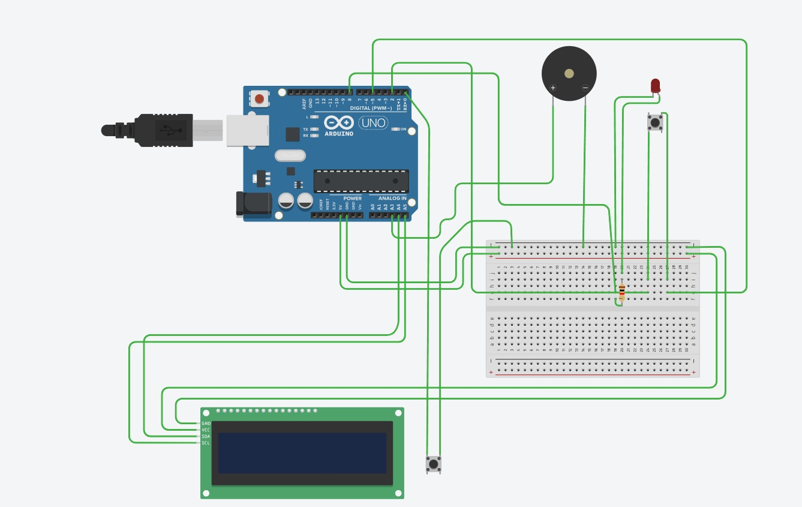
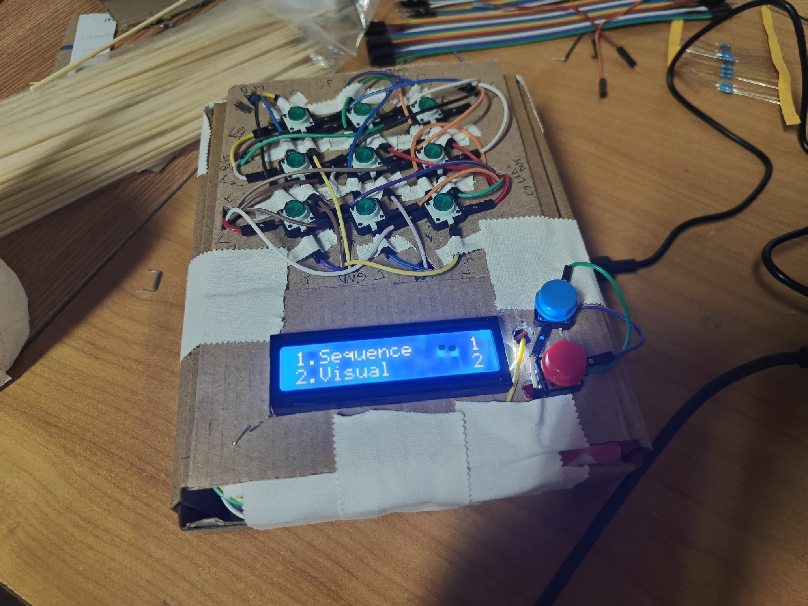
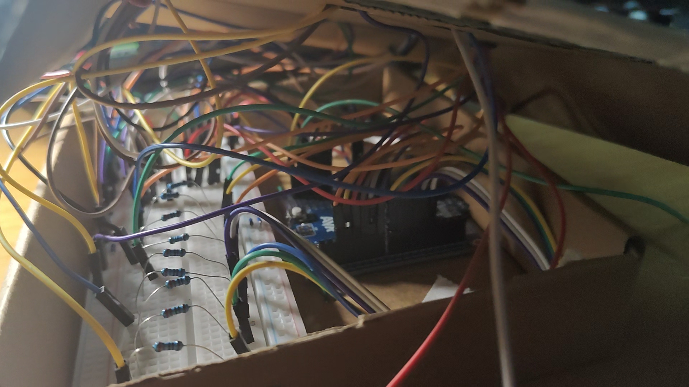
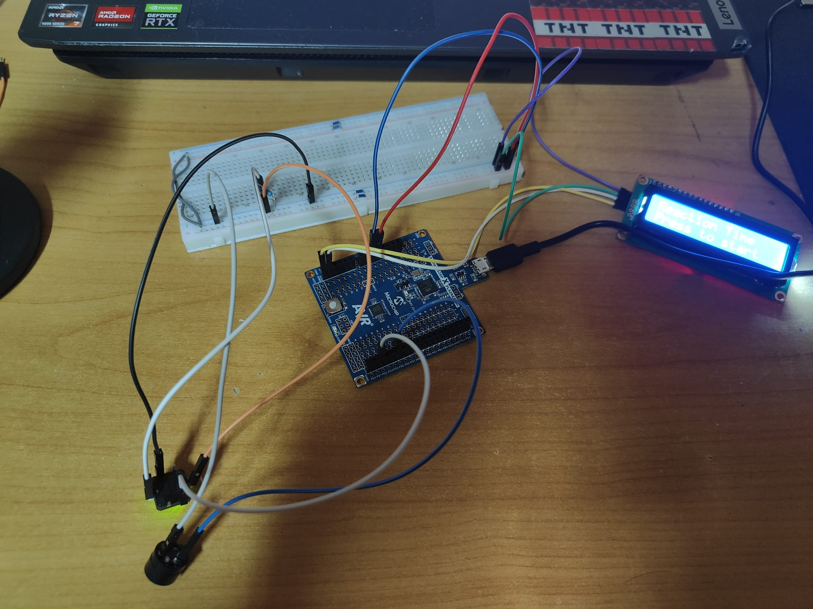

# Jocuri Interactive de Memorie

## Descriere generala

Proiectul consta intr-un sistem interactiv inspirat de jocurile de pe HumanBenchmark, bazat pe o matrice 3x3 de butoane iluminate controlata de un microcontroller ATmega328P.

Utilizatorul poate selecta unul dintre cele doua jocuri folosind un display LCD I2C si doua butoane dedicate pentru meniu.

Jocurile implementate:
- Sequence Memory
- Visual Memory

Sistemul include:
- afisare LCD
- feedback vizual prin LED-uri
- feedback audio prin buzzer
- highscore
- dificultate progresiva

---

## Functionalitati

### Sequence Memory

Sistemul genereaza o secventa de LED-uri care trebuie memorata si reprodusa in ordinea corecta.

La fiecare runda:
- secventa devine mai lunga
- dificultatea creste progresiv

### Visual Memory

Mai multe LED-uri sunt aprinse simultan pentru o perioada limitata de timp.

Utilizatorul trebuie sa memoreze pozitiile LED-urilor si sa reproduca pattern-ul corect.

Dificultatea creste prin:
- reducerea timpului de afisare
- cresterea complexitatii pattern-urilor

---

## Hardware

### Componente utilizate

| Componenta | Cantitate |
|---|---|
| ATmega328P Xplained Mini | 1 |
| LCD 1602 I2C | 1 |
| Butoane iluminate | 9 |
| Butoane meniu | 2 |
| Buzzer pasiv | 1 |
| Rezistoare 220 ohm | 9 |
| Breadboard | 1 |
| Fire jumper | multiple |

---

## Schema electrica



---

## Imagini proiect

### Vedere hardware



### Interior



### Etapa de dezvoltare



---

## Software

Firmware-ul este implementat in limbajul C folosind:
- AVR-GCC
- PlatformIO
- acces direct la registre AVR

Nu a fost utilizat framework-ul Arduino.

Functionalitati software:
- driver I2C/TWI
- control LCD
- scanare matrice de butoane
- control LED-uri
- generare pseudo-random
- sistem de meniu
- jocuri interactive
- feedback audio

---

## Structura repository-ului

```text
.
├── src/
│   └── main.c
│
├── hardware/
│   ├── schema.png
│   └── tinkercad.jpeg
│
├── images/
│   ├── interior.jpeg
│   ├── poza_proiect_neterminat.jpeg
│   └── proiect_terminat.jpeg
│
├── platformio.ini
└── README.md

```

## Demo Video

## Demo Video

[](https://youtube.com/shorts/aedmHb92XfA)
